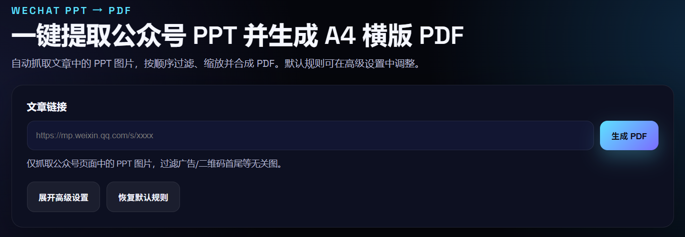

# 微信文章提取 PPT 并生成 PDF

基于 FastAPI + React 的 Web 工具：输入微信公众号文章链接，自动抓取文章中的 PPT 图片并生成 A4 横向 PDF。

## 注意

该项目 **仅供学习使用，请勿爬取商用素材！** 一切因此产生的法律纠纷与本作者无关！



## 目录结构
- `api/`：后端 FastAPI 服务
- `web/`：前端 React (Vite)

## 快速开始

### 后端
```bash
cd api
python -m venv .venv
.venv\\Scripts\\activate
pip install -r requirements.txt
uvicorn main:app --reload --host 0.0.0.0 --port 8000
```

### 前端
```bash
cd web
npm install
npm run dev
```
Vite 已配置代理，开发时通过 `http://localhost:5173` 访问，接口自动转发至 `http://localhost:8000/process`。

## 接口说明
`POST /process`
```json
{
  "url": "https://mp.weixin.qq.com/s/xxxx",
  "filters": {
    "allowed_domains": ["mmbiz.qpic.cn"],
    "min_area": 300000,
    "min_width": 600,
    "min_height": 400,
    "aspect_ratio_min": 0.6,
    "aspect_ratio_max": 1.8,
    "trim_leading": 2,
    "trim_trailing": 2
  }
}
```
成功时返回 PDF 二进制流（`Content-Disposition: attachment; filename="ppt.pdf"`）。

## 过滤规则（默认）
- 仅保留来自 `mmbiz.qpic.cn`
- 像素面积 > 300k
- 最小宽/高：600 / 400
- 宽高比 0.6 – 1.8
- 去除首尾各 2 张
- PDF：A4 横向，按比例缩放居中，不放大超过原始尺寸

## 其他
- 健康检查：`GET /health`
- 临时图片保存在内存中，PDF 生成后即释放。
